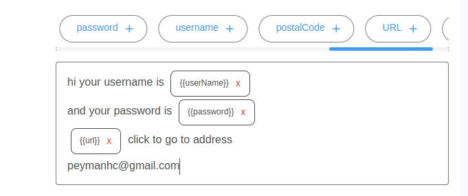

# Textarea Pattern Handler

A modern, flexible React component for handling text input with pattern/tag support. This component provides a rich textarea-like experience with the ability to insert, remove, and manage tags within the text content.



## Features

- 🔄 Real-time tag insertion and removal
- ⌨️ Rich text editing capabilities
- 🎨 Customizable styling with dark mode support
- 📱 Mobile-friendly and responsive design
- 🔍 Pattern matching and tag management
- ⚡ Built with TypeScript for type safety
- 🎯 React 16.8+ compatible (uses hooks)

## Installation

```bash
npm install textarea-pattern-handler
# or
yarn add textarea-pattern-handler
```

## Usage

```jsx
import React, { useState, useRef } from 'react';
import PreTagTextarea from 'textarea-pattern-handler';
import 'textarea-pattern-handler/dist/styles.css';

const App = () => {
  const [value, setValue] = useState('');
  const textareaRef = useRef(null);

  const handleRemoveTag = (tagText) => {
    console.log('Tag removed:', tagText);
  };

  const addTag = () => {
    textareaRef.current?.addTag('New Tag');
  };

  return (
    <div>
      <PreTagTextarea
        ref={textareaRef}
        value={value}
        setValue={setValue}
        onRemoveTag={handleRemoveTag}
        placeholder="Type here..."
      />
      <button onClick={addTag}>Add Tag</button>
    </div>
  );
};
```

## Props

| Prop | Type | Description |
|------|------|-------------|
| `value` | `string` | The current text value |
| `setValue` | `(value: string) => void` | Function to update the text value |
| `onRemoveTag` | `(tagText: string) => void` | Callback when a tag is removed |
| `className` | `string` | Additional CSS classes |
| `node` | `React.ReactElement` | Custom element to render instead of div |
| `fixedText` | `string` | Text that cannot be modified |
| `defaultValue` | `string` | Initial text value |
| `id` | `string` | Element ID (default: 'preTagBox') |

## Methods

The component exposes the following methods through the ref:

- `addTag(tagContent: string)`: Adds a new tag at the current cursor position
- `addText(textContent: string)`: Adds text at the current cursor position

## Styling

The component comes with built-in styles that support both light and dark modes. You can customize the appearance by overriding the following CSS classes:

- `.patternBox`: Main container
- `.tag`: Tag elements
- `.placeholderOfTextareaWithPattern`: Placeholder text style

## Browser Support

- Chrome (latest)
- Firefox (latest)
- Safari (latest)
- Edge (latest)

## Contributing

Contributions are welcome! Please feel free to submit a Pull Request.

## License

ISC License - feel free to use this component in your projects.

## Author

- **Peyman**
  - GitHub: [@peymanhc](https://github.com/peymanhc)
  - Email: peymanhc@gmail.com

## Support

If you encounter any issues or have questions, please open an issue on the GitHub repository. 